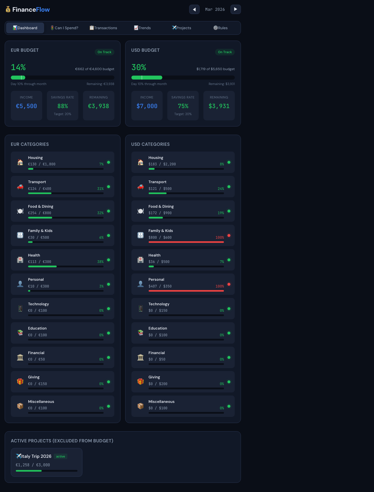
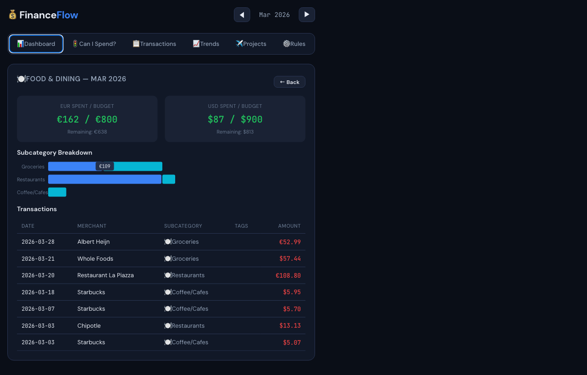
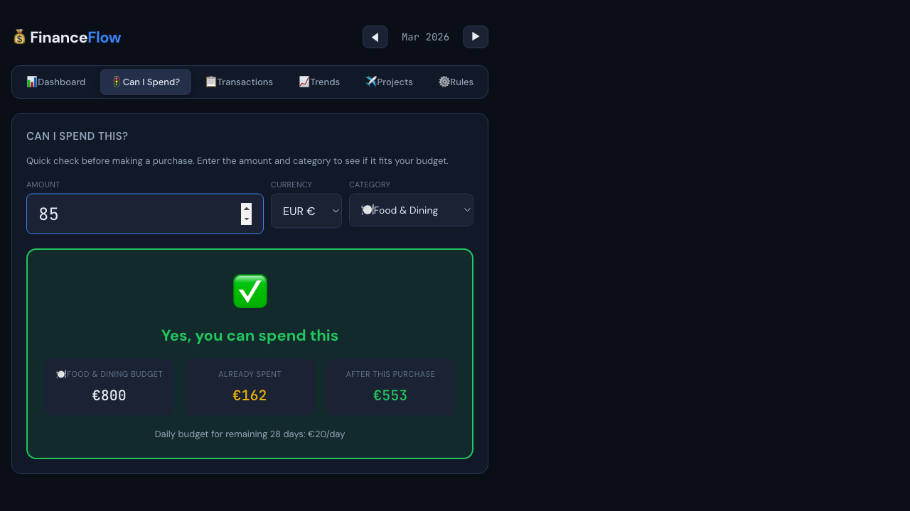
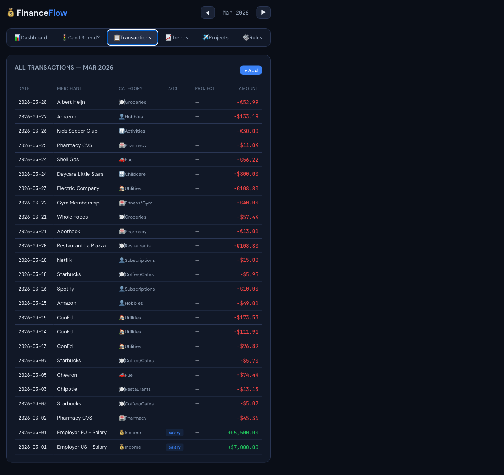
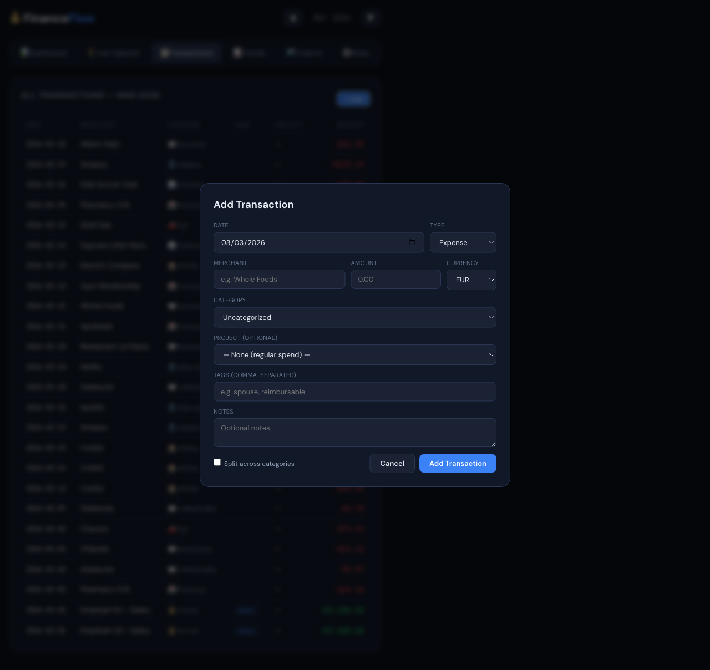
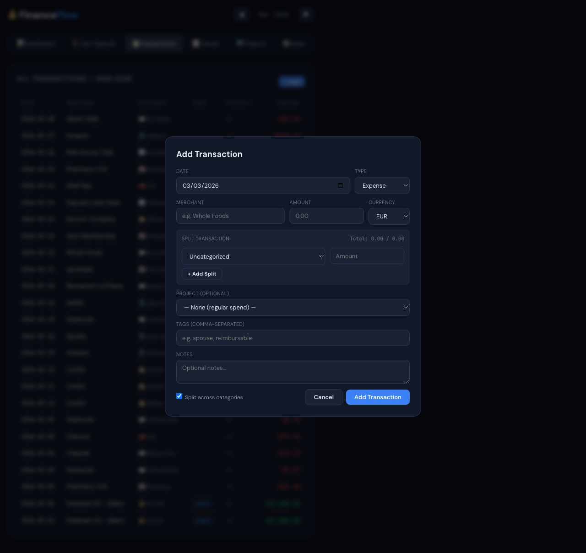
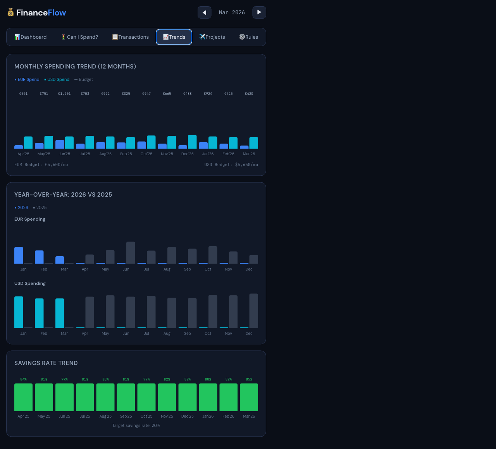
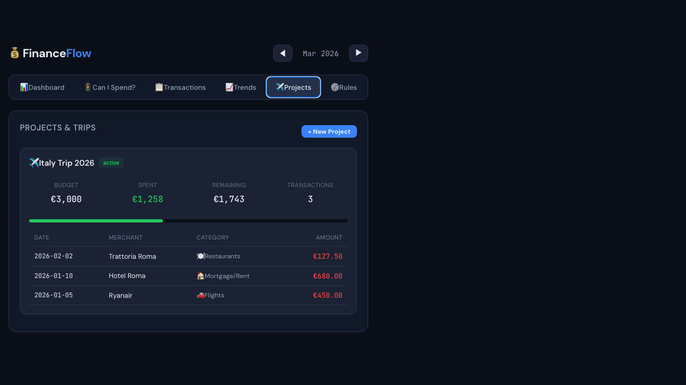
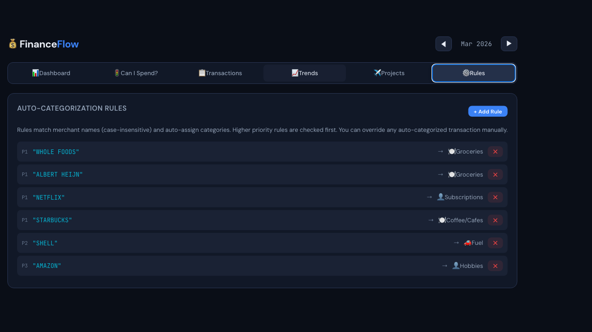

# FinanceFlow — User Walkthrough

*2026-03-03 by Showboat 0.6.1*
<!-- showboat-id: a3dc93c1-8b14-4239-8492-d97b9381d7a2 -->

FinanceFlow is a personal finance tracker that handles **dual-currency (EUR + USD)** household budgets with traffic-light indicators, a quick-decision spend tool, trend charts, and isolated project tracking. It runs entirely in the browser — no login, no backend, no configuration.

To launch it locally:

```bash
cd vite-app && npm run dev
# Open http://localhost:5173
```

---

## 1. Dashboard

The Dashboard is your command centre. At a glance you see:

- **Two overall budget meters** — one for EUR household spending, one for USD — each showing percentage used, income, savings rate, and remaining budget.
- **Traffic-light category rows** — green means on track, amber means approaching the limit, red means over budget. The coloured dot and progress bar give you an instant read.
- **Active Projects card** at the bottom — shows any trips or one-off projects excluded from the regular budget.

Use the **◀ ▶ arrows** in the header to navigate between months.



---

## 2. Category Drill-Down

Click any **category row** on the dashboard to drill into its subcategories and the individual transactions behind them.

Here we clicked **Food & Dining** to see:
- EUR and USD totals vs. budget at the top
- A horizontal **Subcategory Breakdown** bar chart (Groceries, Restaurants, Coffee/Cafes)
- Every transaction in that category for the month, with merchant, subcategory, and amount

Click **← Back** to return to the full dashboard.



---

## 3. Can I Spend?

The **Can I Spend?** tab gives you an instant go/no-go before making a purchase. Enter:

1. **Amount** — the purchase you're considering
2. **Currency** — EUR or USD
3. **Category** — which budget bucket it comes from

FinanceFlow checks your remaining budget for that category and renders a green ✅ **"Yes, you can spend this"** or red ❌ verdict. It also shows how much budget remains after the purchase and your **daily budget for the rest of the month**.

Below: €85 in Food & Dining — approved, with €553 remaining after purchase.

```bash
# rodney commands used
uvx rodney click ".nav button:nth-child(2)"
uvx rodney input "input[type=number]" "85"
```



---

## 4. Transactions

The **Transactions** tab shows every transaction for the selected month in a sortable table — date, merchant, category badge, tags, project, and amount. Income rows appear in green; expenses in red.

Click **+ Add** (top right) to open the add-transaction modal.



---

## 5. Add Transaction

The **+ Add** modal lets you record any transaction:

- **Date, merchant, amount, currency** — the basics
- **Category** — choose from the full two-level hierarchy
- **Project** — optionally tag the transaction to an active project (e.g. Italy Trip)
- **Tags** — comma-separated labels for custom filtering
- **Notes** — free-form memo

### Split mode

Enable **"Split across categories"** to divide one transaction across multiple budget lines — useful for a supermarket receipt that includes both groceries and household items.

```bash
uvx rodney click ".nav button:nth-child(3)"   # Transactions tab
uvx rodney click ".btn-primary"               # + Add button
uvx rodney click "input[type=checkbox]"       # Enable splits
```

| Modal — standard | Modal — split enabled |
|---|---|
|  |  |

---

## 6. Trends

The **Trends** tab shows three charts for the last 12 months:

1. **Monthly Spending Trend** — side-by-side EUR and USD bars with budget reference lines
2. **Year-over-Year** — 2026 vs 2025 comparison for both currencies (bright bars = current year, grey = previous)
3. **Savings Rate Trend** — green bars showing your actual savings rate each month vs. the 20% target



---

## 7. Projects

The **Projects** tab tracks spending for one-off trips or goals, **excluded from your regular monthly budget** so they don't pollute your day-to-day numbers.

Each project card shows:
- Budget, amount spent, remaining, and transaction count
- A **progress bar** (green while under budget)
- A transaction list scoped to that project

Click **+ New Project** to create a trip or renovation budget.



---

## 8. Rules

The **Rules** tab manages **auto-categorization rules**. Each rule matches a merchant name (case-insensitive) and automatically assigns a category when you add a transaction with that merchant.

Rules have a priority (P1, P2, P3 …) — higher-priority rules are checked first. You can override any auto-categorized transaction manually after the fact.

Click **+ Add Rule** to create a new pattern.



---

## Summary

| Tab | What it answers |
|---|---|
| Dashboard | "How am I tracking this month overall?" |
| Drill-Down | "Where exactly is my food budget going?" |
| Can I Spend? | "Can I afford this €85 dinner tonight?" |
| Transactions | "What did I actually spend money on?" |
| Add Transaction | "Let me record this receipt." |
| Trends | "Am I spending more than last year?" |
| Projects | "How much of my Italy budget is left?" |
| Rules | "Why did that transaction get categorized as Hobbies?" |

All data lives in browser memory and resets on page reload. To persist data, connect the `transactions`, `projects`, and `rules` state to `localStorage` or a backend.
