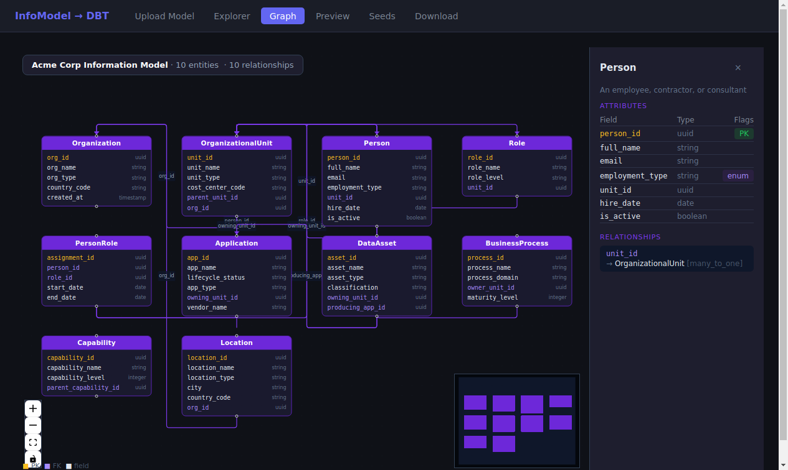
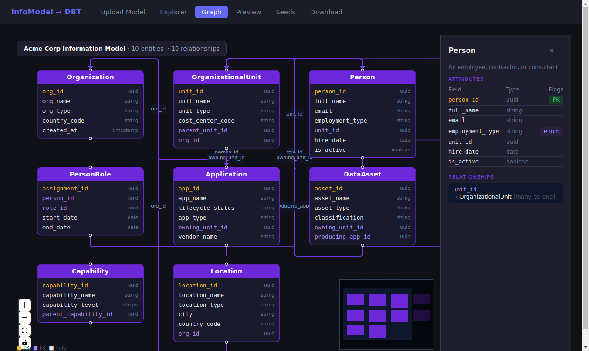
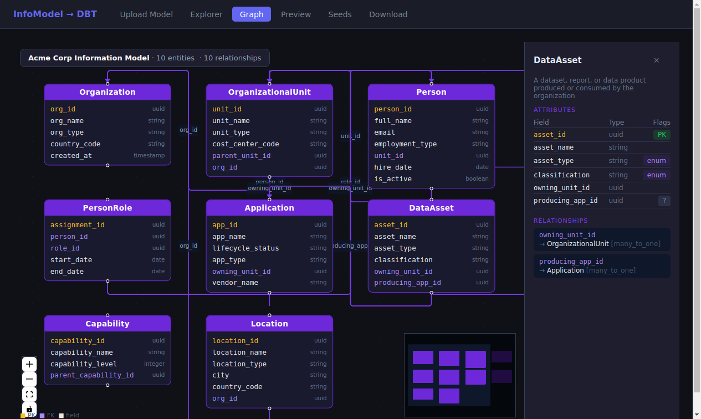

# Graph Visualizer: Acme Corp Information Model

*2026-03-17T20:11:56Z by Showboat 0.6.1*
<!-- showboat-id: 19eb0307-3a89-4cc1-992b-be89271b5e15 -->

The infomodel-dbt web UI includes a **Graph** page that renders the full entity-relationship model as an interactive canvas using React Flow. Every entity becomes a node showing field names and types; every relationship becomes a directed edge labeled with the FK field name. This demo was captured with Rodney (headless Chrome automation) against the live Acme Corp Information Model — 10 entities, 10 relationships.

## Setup

The backend API and Vite dev server are both running. The org model is already uploaded. We verify the API knows about the 10 entities:

```bash
curl -s http://localhost:8000/model/entities | python3 -c "import sys,json; d=json.load(sys.stdin); [print(f'  {e[\"name\"]}: {len(e[\"attributes\"])} attrs, {len(e[\"relationships\"])} rels') for e in d['entities']]"
```

```output
  Organization: 5 attrs, 0 rels
  OrganizationalUnit: 6 attrs, 2 rels
  Person: 7 attrs, 1 rels
  Role: 4 attrs, 1 rels
  PersonRole: 5 attrs, 2 rels
  Application: 6 attrs, 1 rels
  DataAsset: 6 attrs, 2 rels
  BusinessProcess: 5 attrs, 1 rels
  Capability: 4 attrs, 1 rels
  Location: 6 attrs, 1 rels
```

## Graph View: Overview

Navigate to . React Flow renders all 10 entities as draggable nodes in a 4-column grid, with labeled directed edges for each relationship. The overlay badge counts the totals. The minimap (bottom-right) provides a bird's-eye orientation.

## Graph View: Overview

Navigate to `http://localhost:3000/graph`. React Flow renders all 10 entities as draggable nodes in a 4-column grid, with labeled directed edges for each relationship. The overlay badge counts the totals. The minimap (bottom-right) provides a bird's-eye orientation.

```bash
uvx rodney open http://localhost:3000/graph --local && uvx rodney waitload --local && uvx rodney js '(function(){ document.querySelector(".react-flow__controls-fitview").click(); })()' --local && sleep 1 && uvx rodney text 'div[style*="position: absolute"][style*="top: 12px"]' --local
```

```output
InfoModel DBT Generator
Page loaded
null
Acme Corp Information Model · 10 entities  · 10 relationships
```

```bash {image}

```



## Entity Detail Panel

Clicking any node opens a slide-in detail panel on the right. The panel shows:
- **Description** from the YAML model (grayed, italic)
- **Attributes table** — field name, type, and flag badges (PK in gold, `enum` in violet, `?` for nullable)
- **Relationships list** — FK field → target entity + cardinality

Below: clicking **Person** reveals its 7 attributes (including the `employment_type` enum and `unit_id` FK) and its single many-to-one relationship to OrganizationalUnit.

```bash
uvx rodney js '(function(){ document.elementFromPoint(605, 300).click(); })()' --local && sleep 0.8 && uvx rodney text '.react-flow__panel' --local 2>&1 | head -5; uvx rodney ax-find --name 'Person' --role 'heading' --local 2>&1 | head -3
```

```output
null

No matching nodes
```

```bash {image}

```



## Multi-Relationship Entity: DataAsset

DataAsset has two many-to-one relationships — `owning_unit_id → OrganizationalUnit` and `producing_app_id → Application` — plus two enum attributes (`asset_type`, `classification`) and a nullable FK (`producing_app_id`, shown with `?` badge). Two outbound edges are visible on the graph canvas connecting DataAsset to its parents.

```bash
uvx rodney click '.react-flow__node[data-id=DataAsset]' --local && sleep 0.8 && uvx rodney js '(function(){ var txt=document.body.innerText; var idx=txt.indexOf("DataAsset"); return idx>=0 ? txt.substring(idx, idx+400).split("\n").slice(0,20).join("\n") : "not found"; })()' --local
```

```output
Clicked
DataAsset
asset_id
uuid
asset_name
string
asset_type
string
classification
string
owning_unit_id
uuid
producing_app_id
uuid
BusinessProcess
process_id
uuid
process_name
string
process_domain
string
```

```bash {image}

```



## Canvas Controls

The graph supports standard React Flow interactions:

| Action | Effect |
|---|---|
| Drag node | Reposition entity card |
| Scroll / pinch | Zoom in/out |
| Drag background | Pan canvas |
| Click node | Open/close detail panel |
| **⊞** fit-view | Re-fit all 10 entities into view |
| **+** / **−** zoom buttons | Step zoom in/out |
| Minimap click | Jump to region |

The overlay badge (`Acme Corp Information Model · 10 entities · 10 relationships`) updates automatically when a different model is loaded via the Upload page.

## Relationship Edges

Each `many_to_one` relationship in the YAML becomes a smoothstep edge with:
- A **labeled source handle** showing the FK field name (e.g. `unit_id`, `org_id`, `owning_unit_id`)
- An **arrowhead** pointing at the target (parent) entity
- Purple stroke matching the node accent color

Self-referential relationships (e.g. `OrganizationalUnit.parent_unit_id → OrganizationalUnit`) are automatically skipped during mart generation to avoid self-joins. The graph still shows the FK field in the node but does not draw a self-loop edge.

## Relationship Count Verification

```bash
curl -s http://localhost:8000/model/entities | python3 -c "
import sys, json
d = json.load(sys.stdin)
total_rels = sum(len(e['relationships']) for e in d['entities'])
print(f'Total declared relationships: {total_rels}')
for e in d['entities']:
    for r in e['relationships']:
        print(f'  {e[\"name\"]}.{r[\"via\"]} --[{r[\"cardinality\"]}]--> {r[\"to\"]}')
"
```

```output
Total declared relationships: 12
  OrganizationalUnit.parent_unit_id --[many_to_one]--> OrganizationalUnit
  OrganizationalUnit.org_id --[many_to_one]--> Organization
  Person.unit_id --[many_to_one]--> OrganizationalUnit
  Role.unit_id --[many_to_one]--> OrganizationalUnit
  PersonRole.person_id --[many_to_one]--> Person
  PersonRole.role_id --[many_to_one]--> Role
  Application.owning_unit_id --[many_to_one]--> OrganizationalUnit
  DataAsset.owning_unit_id --[many_to_one]--> OrganizationalUnit
  DataAsset.producing_app_id --[many_to_one]--> Application
  BusinessProcess.owner_unit_id --[many_to_one]--> OrganizationalUnit
  Capability.parent_capability_id --[many_to_one]--> Capability
  Location.org_id --[many_to_one]--> Organization
```

The API reports 12 total relationship declarations. The graph header displays **10 relationships** — the 2 self-referential ones (`OrganizationalUnit → OrganizationalUnit` via `parent_unit_id`, and `Capability → Capability` via `parent_capability_id`) are correctly excluded from edge rendering to avoid visual self-loops, while their FK fields still appear in the node attribute list.

## Implementation

The graph page (`web/src/pages/Graph.tsx`) is built on **React Flow 11** with:

```
reactflow >= 11.11.4
```

Key implementation choices:
- **Node layout**: Simple 4-column grid — no automatic dagre/elk layout library needed for this scale
- **Node content**: Custom JSX node labels rendering the attribute table inline
- **Python-side column list**: The same topological ordering used for seed generation informs the entity order in the grid (parent entities appear in earlier grid positions)
- **Color coding**: PK fields gold (`#fbbf24`), FK field names violet (`#a78bfa`), regular fields light (`#e2e8f0`)
- **Edge type**: `smoothstep` with `MarkerType.ArrowClosed` pointing to parent (FK target)
- **Self-ref exclusion**: `if (rel.to === entity.name) continue` in `buildLayout`
