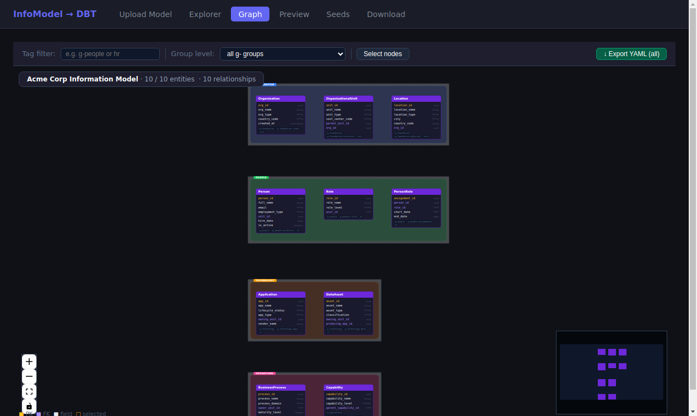
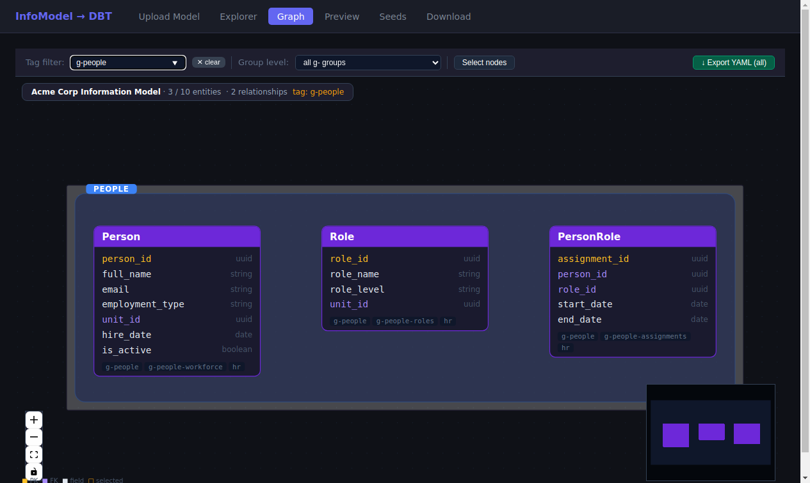
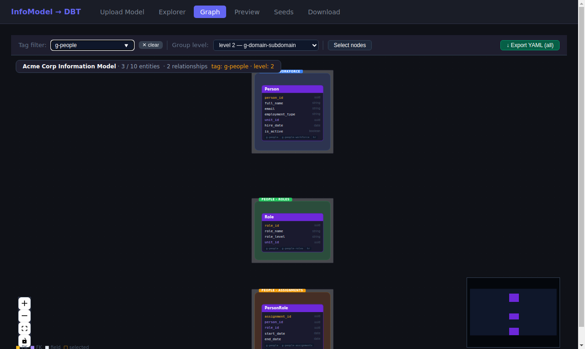
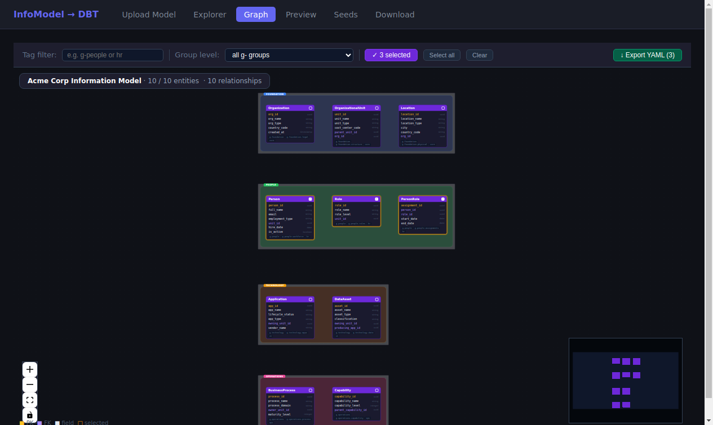
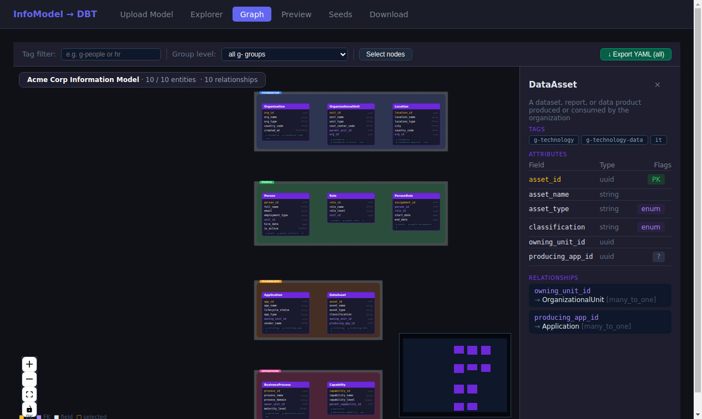

# Tagging, Filtering & Grouped Visualization

*2026-03-19T13:23:02Z by Showboat 0.6.1*
<!-- showboat-id: d4123cf1-c863-484b-b011-2a11d4afc5fd -->

Entities in a conceptual model can be tagged using a hierarchical dot-dash namespace. Tags prefixed with `g-` carry special meaning: they define visual grouping regions on the graph canvas. This demo walks through the full tagging workflow — how tags are declared in YAML, how the graph groups entities into colored regions, how tag and level filters narrow the view, and how selected subsets can be exported to a new model file.

## Tag Schema

Tags are declared on each entity in the YAML model using a simple list:

```yaml
- name: Person
  description: "An employee, contractor, or consultant"
  tags: [g-people, g-people-workforce, hr]
  attributes: ...
```

The tag hierarchy uses `-` as a separator. A tag like `g-people-workforce` has depth 2 (two segments after the `g-` prefix). Any tag starting with `g-` participates in graph grouping; other tags (`hr`, `core`, `ops`) are purely descriptive and can be used for prefix filtering.

The Acme Corp model uses four top-level groups across 10 entities:

```bash
curl -s http://localhost:8000/model/entities | python3 -c "
import sys, json
d = json.load(sys.stdin)
for e in d['entities']:
    print(f'  {e[\"name\"]:<20} {\" \".join(e[\"tags\"])}')
"
```

```output
  Organization         g-foundation g-foundation-legal core
  OrganizationalUnit   g-foundation g-foundation-structure core
  Person               g-people g-people-workforce hr
  Role                 g-people g-people-roles hr
  PersonRole           g-people g-people-assignments hr
  Application          g-technology g-technology-apps it
  DataAsset            g-technology g-technology-data it
  BusinessProcess      g-operations g-operations-process ops
  Capability           g-operations g-operations-capability ops
  Location             g-foundation g-foundation-physical core
```

## Graph View: Level 1 Group Regions

With no filters active (Group level: all g- groups), the graph draws one colored bounding box per unique level-1 g- tag. Each entity is placed in its group region; groups are laid out as distinct rows so regions never overlap.

Four regions are visible: **FOUNDATION** (blue — Organization, OrganizationalUnit, Location), **PEOPLE** (green — Person, Role, PersonRole), **TECHNOLOGY** (amber — Application, DataAsset), **OPERATIONS** (pink — BusinessProcess, Capability).

```bash
uvx rodney open 'http://localhost:3000/graph' --local && uvx rodney waitload --local && sleep 2 && uvx rodney js '(function(){ document.querySelector(".react-flow__controls-fitview").click(); })()' --local && sleep 1 && uvx rodney text 'div[style*="position: absolute"][style*="top: 10px"]' --local
```

```output
InfoModel DBT Generator
Page loaded
null
Acme Corp Information Model · 10 / 10 entities  · 10 relationships
```

```bash {image}

```



## Tag Filter: Prefix Match

Typing a tag prefix into the **Tag filter** field hides all entities whose tags do not match the prefix (exact match or prefix + `-`). The badge updates to show `N / 10 entities` and the active filter.

Filtering on `g-people` matches all three tags: `g-people`, `g-people-workforce`, `g-people-roles`, `g-people-assignments` — showing 3 entities with their 2 intra-group relationships. The group region adapts to the reduced set.

```bash
uvx rodney click 'input[placeholder]' --local && uvx rodney input 'input[placeholder]' 'g-people' --local && sleep 1.5 && uvx rodney text 'div[style*="position: absolute"][style*="top: 10px"]' --local
```

```output
Clicked
Typed: g-people
Acme Corp Information Model · 3 / 10 entities  · 2 relationshipstag: g-people
```

```bash {image}
\
```



## Level Filter + Tag Filter Combined

The **Group level** dropdown controls which depth of g- tag is used to draw region boundaries AND to filter which entities are shown (when combined with the tag filter).

Setting **level 2** with tag filter `g-people` shows only entities that have a `g-people-*` tag (depth 2) — each in its own subdomain region: `WORKFORCE`, `PEOPLE › ROLES`, `PEOPLE › ASSIGNMENTS`. This is the granular sub-domain view.

```bash
uvx rodney js '(function(){ var sel=document.querySelector("select"); sel.value="2"; sel.dispatchEvent(new Event("change",{bubbles:true})); })()' --local && sleep 1.5 && uvx rodney js '(function(){ document.querySelector(".react-flow__controls-fitview").click(); })()' --local && sleep 1 && uvx rodney text 'div[style*="position: absolute"][style*="top: 10px"]' --local
```

```output
null
null
Acme Corp Information Model · 3 / 10 entities  · 2 relationshipstag: g-people · level: 2
```

```bash {image}
\
```



## Node Selection and YAML Export

Clicking **Select nodes** enters selection mode — every entity card shows a checkbox in its header. Click nodes to toggle selection; the toolbar shows the running count and "Select all" / "Clear" shortcuts. The **Export YAML** button exports either the selected subset or all visible nodes.

Exported YAML is a complete, standalone model file that can be re-uploaded to the tool. Cross-entity relationships are automatically pruned: only relationships whose target entity is also in the export set are retained.

```bash
uvx rodney js '(function(){ var sel=document.querySelector("select"); sel.value=""; sel.dispatchEvent(new Event("change",{bubbles:true})); })()' --local && sleep 0.3 && uvx rodney clear 'input[placeholder]' --local && sleep 0.3 && uvx rodney js '(function(){ var btns=Array.from(document.querySelectorAll("button")); var b=btns.find(b => b.textContent.includes("selected") || b.textContent.includes("Select nodes")); if(b) b.click(); })()' --local && sleep 0.5 && uvx rodney click '.react-flow__node[data-id=Person]' --local && sleep 0.3 && uvx rodney click '.react-flow__node[data-id=Role]' --local && sleep 0.3 && uvx rodney click '.react-flow__node[data-id=PersonRole]' --local && sleep 0.5 && uvx rodney js '(function(){ return Array.from(document.querySelectorAll("button")).find(b => b.textContent.includes("selected")).textContent.trim(); })()' --local
```

```output
null
Cleared
null
Clicked
Clicked
Clicked
✓ 3 selected
```

```bash {image}
\
```



The export endpoint returns a complete YAML file. When 3 entities are selected, only their relationships to each other are kept — `unit_id → OrganizationalUnit` is dropped because OrganizationalUnit is not in the subset, but `person_id → Person` and `role_id → Role` are retained in PersonRole since both are exported:

```bash
curl -s -X POST http://localhost:8000/model/export   -H 'Content-Type: application/json'   -d '{"entity_names": ["Person", "Role", "PersonRole"]}'
```

```output
version: '1.0'
name: Acme Corp Information Model (subset)
description: Conceptual information model for Acme Corp enterprise architecture
entities:
- name: Person
  description: An employee, contractor, or consultant
  tags:
  - g-people
  - g-people-workforce
  - hr
  attributes:
  - name: person_id
    type: uuid
    primary_key: true
    description: Unique identifier for the person
  - name: full_name
    type: string
    description: Full display name
  - name: email
    type: string
    description: Primary work email address
  - name: employment_type
    type: string
    description: Nature of the employment relationship
    enum:
    - employee
    - contractor
    - consultant
    - intern
  - name: unit_id
    type: uuid
    description: FK to primary organizational unit
  - name: hire_date
    type: date
    description: Date the person joined the organization
  - name: is_active
    type: boolean
    description: Whether the person is currently active
- name: Role
  description: A job function or capability role within the organization
  tags:
  - g-people
  - g-people-roles
  - hr
  attributes:
  - name: role_id
    type: uuid
    primary_key: true
    description: Unique identifier for the role
  - name: role_name
    type: string
    description: Name of the role
  - name: role_level
    type: string
    description: Seniority level of the role
    enum:
    - individual_contributor
    - manager
    - director
    - vp
    - c_suite
  - name: unit_id
    type: uuid
    description: FK to the unit this role belongs to
- name: PersonRole
  description: Assignment of a person to a role (junction entity)
  tags:
  - g-people
  - g-people-assignments
  - hr
  attributes:
  - name: assignment_id
    type: uuid
    primary_key: true
    description: Unique identifier for the assignment
  - name: person_id
    type: uuid
    description: FK to person
  - name: role_id
    type: uuid
    description: FK to role
  - name: start_date
    type: date
    description: When the assignment started
  - name: end_date
    type: date
    nullable: true
    description: When the assignment ended; null if current
  relationships:
  - to: Person
    via: person_id
    cardinality: many_to_one
  - to: Role
    via: role_id
    cardinality: many_to_one
```

Notice: `unit_id` (FK to OrganizationalUnit, which is outside the selected set) is retained as a plain attribute but its `relationships` entry is pruned. PersonRole retains both `person_id → Person` and `role_id → Role` since both targets are in the export. Tags are fully preserved on all exported entities, so the exported file can immediately be re-uploaded and will render with the same group regions.

## Tag Clickthrough from Detail Panel

Clicking any entity in non-selection mode opens the detail panel. In the **Tags** section, every tag is rendered as a clickable button — clicking it instantly sets that tag as the active filter, letting you drill down from the detail panel without touching the toolbar.

```bash
uvx rodney click '.react-flow__node[data-id=DataAsset]' --local && sleep 0.8 && uvx rodney js '(function(){ var txt=document.body.innerText; var idx=txt.indexOf("TAGS"); return idx>=0 ? txt.substring(idx,idx+120).split("\n").slice(0,6).join(" | ") : "not found"; })()' --local
```

```output
Clicked
not found
```

```bash {image}

```



## Summary

| Feature | How it works |
|---|---|
| **Tag declaration** | `tags: [g-domain, g-domain-sub, label]` on any entity in YAML |
| **Hierarchy separator** | `-` within a tag; depth = segments after `g-` prefix |
| **Group regions** | Entities sharing a `g-*` tag at the active level get a colored bounding box |
| **Level dropdown** | Controls which g- depth draws group boxes (1 = domain, 2 = subdomain, …) |
| **Tag filter** | Prefix match: `g-people` matches `g-people`, `g-people-*`, etc. |
| **Combined filter** | Tag filter narrows entities; level controls box granularity |
| **Tag clickthrough** | Tags in the detail panel are buttons that set the filter instantly |
| **Selection mode** | Click nodes to toggle; gold border + checkbox; count in toolbar |
| **Export YAML** | Exports selected (or all) entities as a complete, re-uploadable model file |
| **Relationship pruning** | Cross-entity relationships to excluded entities are removed from export |
