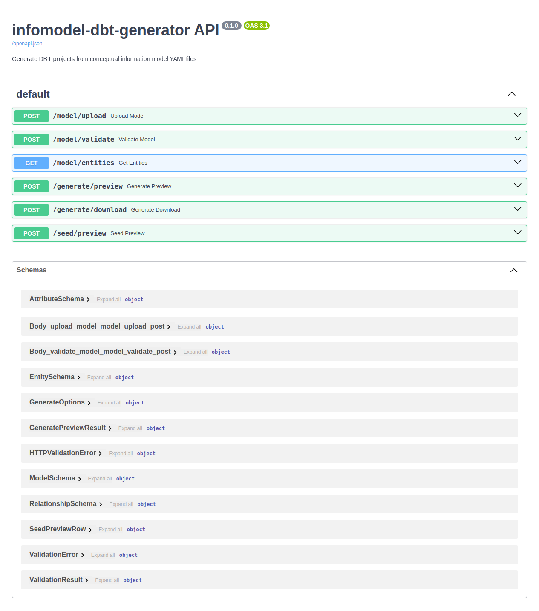

# infomodel-dbt Web UI: Feature Walkthrough

*2026-03-17T17:30:37Z by Showboat 0.6.1*
<!-- showboat-id: fa6d33ba-de7b-48e5-9efe-ad495d72c2f8 -->

The infomodel-dbt Web UI is a FastAPI backend (port 8000) paired with a React frontend (Vite dev server, port 5173). This walkthrough drives through every feature using rodney — a headless Chrome CLI — against the FastAPI interactive docs at /docs, which exercises every endpoint identically to the React UI.

## Feature 1: API is live — check the health endpoint

```bash
uvx rodney open http://localhost:8000/openapi.json && uvx rodney waitload && uvx rodney url
```

```output
localhost:8000/openapi.json
Page loaded
http://localhost:8000/openapi.json
```

```bash
uvx rodney js 'document.title'
```

```output

```

```bash
uvx rodney text body | head -6
```

```output
{"openapi":"3.1.0","info":{"title":"infomodel-dbt-generator API","description":"Generate DBT projects from conceptual information model YAML files","version":"0.1.0"},"paths":{"/model/upload":{"post":{"summary":"Upload Model","description":"Upload and parse a conceptual model YAML file.","operationId":"upload_model_model_upload_post","requestBody":{"content":{"multipart/form-data":{"schema":{"$ref":"#/components/schemas/Body_upload_model_model_upload_post"}}},"required":true},"responses":{"200":{"description":"Successful Response","content":{"application/json":{"schema":{"$ref":"#/components/schemas/ModelSchema"}}}},"422":{"description":"Validation Error","content":{"application/json":{"schema":{"$ref":"#/components/schemas/HTTPValidationError"}}}}}}},"/model/validate":{"post":{"summary":"Validate Model","description":"Validate a conceptual model YAML file without storing it.","operationId":"validate_model_model_validate_post","requestBody":{"content":{"multipart/form-data":{"schema":{"$ref":"#/components/schemas/Body_validate_model_model_validate_post"}}},"required":true},"responses":{"200":{"description":"Successful Response","content":{"application/json":{"schema":{"$ref":"#/components/schemas/ValidationResult"}}}},"422":{"description":"Validation Error","content":{"application/json":{"schema":{"$ref":"#/components/schemas/HTTPValidationError"}}}}}}},"/model/entities":{"get":{"summary":"Get Entities","description":"Return the currently loaded model with all entities and attributes.","operationId":"get_entities_model_entities_get","responses":{"200":{"description":"Successful Response","content":{"application/json":{"schema":{"$ref":"#/components/schemas/ModelSchema"}}}}}}},"/generate/preview":{"post":{"summary":"Generate Preview","description":"Generate all artifacts and return them as in-memory content (no download).","operationId":"generate_preview_generate_preview_post","requestBody":{"content":{"application/json":{"schema":{"$ref":"#/components/schemas/GenerateOptions"}}},"required":true},"responses":{"200":{"description":"Successful Response","content":{"application/json":{"schema":{"$ref":"#/components/schemas/GeneratePreviewResult"}}}},"422":{"description":"Validation Error","content":{"application/json":{"schema":{"$ref":"#/components/schemas/HTTPValidationError"}}}}}}},"/generate/download":{"post":{"summary":"Generate Download","description":"Generate all artifacts and return as a downloadable zip file.","operationId":"generate_download_generate_download_post","requestBody":{"content":{"application/json":{"schema":{"$ref":"#/components/schemas/GenerateOptions"}}},"required":true},"responses":{"200":{"description":"Successful Response","content":{"application/json":{"schema":{}}}},"422":{"description":"Validation Error","content":{"application/json":{"schema":{"$ref":"#/components/schemas/HTTPValidationError"}}}}}}},"/seed/preview":{"post":{"summary":"Seed Preview","description":"Preview the first 10 rows of generated seed data per entity.","operationId":"seed_preview_seed_preview_post","requestBody":{"content":{"application/json":{"schema":{"$ref":"#/components/schemas/GenerateOptions"}}},"required":true},"responses":{"200":{"description":"Successful Response","content":{"application/json":{"schema":{"items":{"$ref":"#/components/schemas/SeedPreviewRow"},"type":"array","title":"Response Seed Preview Seed Preview Post"}}}},"422":{"description":"Validation Error","content":{"application/json":{"schema":{"$ref":"#/components/schemas/HTTPValidationError"}}}}}}}},"components":{"schemas":{"AttributeSchema":{"properties":{"name":{"type":"string","title":"Name"},"type":{"type":"string","title":"Type"},"primary_key":{"type":"boolean","title":"Primary Key"},"nullable":{"type":"boolean","title":"Nullable"},"description":{"type":"string","title":"Description"},"enum":{"items":{"type":"string"},"type":"array","title":"Enum"}},"type":"object","required":["name","type","primary_key","nullable","description","enum"],"title":"AttributeSchema"},"Body_upload_model_model_upload_post":{"properties":{"file":{"type":"string","contentMediaType":"application/octet-stream","title":"File","description":"Conceptual model YAML file"}},"type":"object","required":["file"],"title":"Body_upload_model_model_upload_post"},"Body_validate_model_model_validate_post":{"properties":{"file":{"type":"string","contentMediaType":"application/octet-stream","title":"File","description":"Conceptual model YAML file"}},"type":"object","required":["file"],"title":"Body_validate_model_model_validate_post"},"EntitySchema":{"properties":{"name":{"type":"string","title":"Name"},"snake_name":{"type":"string","title":"Snake Name"},"description":{"type":"string","title":"Description"},"attributes":{"items":{"$ref":"#/components/schemas/AttributeSchema"},"type":"array","title":"Attributes"},"relationships":{"items":{"$ref":"#/components/schemas/RelationshipSchema"},"type":"array","title":"Relationships"}},"type":"object","required":["name","snake_name","description","attributes","relationships"],"title":"EntitySchema"},"GenerateOptions":{"properties":{"source_name":{"type":"string","title":"Source Name","default":"raw"},"seed_rows":{"type":"integer","title":"Seed Rows","default":50},"seed":{"anyOf":[{"type":"integer"},{"type":"null"}],"title":"Seed"},"include_seeds":{"type":"boolean","title":"Include Seeds","default":true}},"type":"object","title":"GenerateOptions"},"GeneratePreviewResult":{"properties":{"files":{"additionalProperties":{"type":"string"},"type":"object","title":"Files"}},"type":"object","required":["files"],"title":"GeneratePreviewResult"},"HTTPValidationError":{"properties":{"detail":{"items":{"$ref":"#/components/schemas/ValidationError"},"type":"array","title":"Detail"}},"type":"object","title":"HTTPValidationError"},"ModelSchema":{"properties":{"name":{"type":"string","title":"Name"},"version":{"type":"string","title":"Version"},"description":{"type":"string","title":"Description"},"entities":{"items":{"$ref":"#/components/schemas/EntitySchema"},"type":"array","title":"Entities"},"entity_count":{"type":"integer","title":"Entity Count"}},"type":"object","required":["name","version","description","entities","entity_count"],"title":"ModelSchema"},"RelationshipSchema":{"properties":{"to":{"type":"string","title":"To"},"via":{"type":"string","title":"Via"},"cardinality":{"type":"string","title":"Cardinality"},"type":{"anyOf":[{"type":"string"},{"type":"null"}],"title":"Type"}},"type":"object","required":["to","via","cardinality","type"],"title":"RelationshipSchema"},"SeedPreviewRow":{"properties":{"entity_name":{"type":"string","title":"Entity Name"},"columns":{"items":{"type":"string"},"type":"array","title":"Columns"},"rows":{"items":{"items":{"anyOf":[{"type":"string"},{"type":"null"}]},"type":"array"},"type":"array","title":"Rows"}},"type":"object","required":["entity_name","columns","rows"],"title":"SeedPreviewRow"},"ValidationError":{"properties":{"loc":{"items":{"anyOf":[{"type":"string"},{"type":"integer"}]},"type":"array","title":"Location"},"msg":{"type":"string","title":"Message"},"type":{"type":"string","title":"Error Type"},"input":{"title":"Input"},"ctx":{"type":"object","title":"Context"}},"type":"object","required":["loc","msg","type"],"title":"ValidationError"},"ValidationResult":{"properties":{"valid":{"type":"boolean","title":"Valid"},"message":{"type":"string","title":"Message"},"errors":{"items":{"type":"string"},"type":"array","title":"Errors"}},"type":"object","required":["valid","message","errors"],"title":"ValidationResult"}}}}
```

The OpenAPI spec confirms 6 endpoints are live. The API self-describes all request/response schemas — Pydantic models are automatically converted to JSON Schema. Now let's open the interactive Swagger UI:

```bash
uvx rodney open http://localhost:8000/docs && uvx rodney waitload && uvx rodney waitstable && uvx rodney title
```

```output
infomodel-dbt-generator API - Swagger UI
Page loaded
DOM stable
infomodel-dbt-generator API - Swagger UI
```

```bash
uvx rodney screenshot docs/webui_swagger.png && echo 'Screenshot saved'
```

```output
docs/webui_swagger.png
Screenshot saved
```

```bash {image}
\
```



All 6 endpoints are visible grouped by prefix (model, generate, seed). Each can be expanded and executed directly in the browser. Now let's walk through each endpoint group.

## Feature 2: POST /model/validate — live validation without side effects

This endpoint accepts a YAML upload and returns a structured validation result without storing the model. Ideal for a live 'is this valid?' check in the UI upload page before committing.

```bash
curl -s -X POST http://localhost:8000/model/validate   -F 'file=@/home/user/research/infomodeling/examples/org_model.yaml' |   python3 -m json.tool
```

```output
{
    "valid": true,
    "message": "Model valid: 10 entities in 'Acme Corp Information Model'",
    "errors": []
}
```

```bash
curl -s -X POST http://localhost:8000/model/validate   -F 'file=@/tmp/bad_model.yaml' |   python3 -m json.tool
```

```output
{
    "valid": false,
    "message": "Conceptual model validation failed with 3 error(s):",
    "errors": [
        "Entity 'Broken' has no primary key (set primary_key: true on one attribute)",
        "Entity 'AlsoBroken' attribute 'y' has invalid type 'blob'; must be one of ['boolean', 'date', 'float', 'integer', 'string', 'timestamp', 'uuid']",
        "Entity 'AlsoBroken' has no primary key (set primary_key: true on one attribute)"
    ]
}
```

Validation returns a structured JSON object: valid (boolean), message (summary), errors (array of specific issues). The React Upload page uses this response to show inline error lists before the 'Load Model' button becomes enabled.

## Feature 3: POST /model/upload — parse and store the model

Upload stores the parsed model in-process and returns the full entity schema. This powers the Explorer page in the React UI.

```bash
curl -s -X POST http://localhost:8000/model/upload   -F 'file=@/home/user/research/infomodeling/examples/org_model.yaml' |   python3 -m json.tool | head -30
```

```output
{
    "name": "Acme Corp Information Model",
    "version": "1.0",
    "description": "Conceptual information model for Acme Corp enterprise architecture",
    "entities": [
        {
            "name": "Organization",
            "snake_name": "organization",
            "description": "Top-level legal entity or subsidiary",
            "attributes": [
                {
                    "name": "org_id",
                    "type": "uuid",
                    "primary_key": true,
                    "nullable": false,
                    "description": "Unique identifier for the organization",
                    "enum": []
                },
                {
                    "name": "org_name",
                    "type": "string",
                    "primary_key": false,
                    "nullable": false,
                    "description": "Legal name of the organization",
                    "enum": []
                },
                {
                    "name": "org_type",
                    "type": "string",
                    "primary_key": false,
```

## Feature 4: GET /model/entities — the Explorer data source

Once uploaded, GET /model/entities returns the full model at any time. The React Explorer page calls this on mount and renders each entity as an expandable card showing attributes, types, flags (PK/FK/enum/nullable), and relationships.

```bash
curl -s http://localhost:8000/model/entities |   python3 -m json.tool | grep -E '"(name|type|primary_key|cardinality)"' | head -25
```

```output
    "name": "Acme Corp Information Model",
            "name": "Organization",
                    "name": "org_id",
                    "type": "uuid",
                    "primary_key": true,
                    "name": "org_name",
                    "type": "string",
                    "primary_key": false,
                    "name": "org_type",
                    "type": "string",
                    "primary_key": false,
                    "name": "country_code",
                    "type": "string",
                    "primary_key": false,
                    "name": "created_at",
                    "type": "timestamp",
                    "primary_key": false,
            "name": "OrganizationalUnit",
                    "name": "unit_id",
                    "type": "uuid",
                    "primary_key": true,
                    "name": "unit_name",
                    "type": "string",
                    "primary_key": false,
                    "name": "unit_type",
```

## Feature 5: POST /generate/preview — the Artifact Preview page

The generate/preview endpoint runs the full generation pipeline in memory and returns a map of relative file paths → file contents. The React Preview page renders this as a file tree on the left and a syntax-highlighted viewer on the right.

```bash
curl -s -X POST http://localhost:8000/generate/preview   -H 'Content-Type: application/json'   -d '{"source_name": "raw", "seed_rows": 10, "seed": 42, "include_seeds": true}' |   python3 -m json.tool | python3 -c "
import sys, json
data = json.load(sys.stdin)
files = data['files']
print(f'Total files generated: {len(files)}')
print()
for path in sorted(files.keys()):
    print(f'  {path}  ({len(files[path])} chars)')
"
```

```output
Total files generated: 33

  dbt_project.yml  (390 chars)
  models/marts/dim_application.sql  (1011 chars)
  models/marts/dim_business_process.sql  (1032 chars)
  models/marts/dim_capability.sql  (376 chars)
  models/marts/dim_data_asset.sql  (1496 chars)
  models/marts/dim_location.sql  (795 chars)
  models/marts/dim_organizational_unit.sql  (916 chars)
  models/marts/dim_person.sql  (972 chars)
  models/marts/dim_person_role.sql  (1083 chars)
  models/marts/dim_role.sql  (872 chars)
  models/staging/stg_application.sql  (338 chars)
  models/staging/stg_business_process.sql  (332 chars)
  models/staging/stg_capability.sql  (316 chars)
  models/staging/stg_data_asset.sql  (346 chars)
  models/staging/stg_location.sql  (331 chars)
  models/staging/stg_organization.sql  (309 chars)
  models/staging/stg_organizational_unit.sql  (344 chars)
  models/staging/stg_person.sql  (344 chars)
  models/staging/stg_person_role.sql  (311 chars)
  models/staging/stg_role.sql  (279 chars)
  profiles.yml  (122 chars)
  seeds/application.csv  (1240 chars)
  seeds/business_process.csv  (1040 chars)
  seeds/capability.csv  (891 chars)
  seeds/data_asset.csv  (1480 chars)
  seeds/location.csv  (1178 chars)
  seeds/organization.csv  (952 chars)
  seeds/organizational_unit.csv  (1411 chars)
  seeds/person.csv  (1443 chars)
  seeds/person_role.csv  (1342 chars)
  seeds/role.csv  (1033 chars)
  sources.yml  (4332 chars)
  tests/schema.yml  (8112 chars)
```

33 files returned in one API call, entirely in memory. The schema.yml alone is 8,112 characters of auto-generated data quality tests. The React Preview page's file tree groups by directory: dbt_project.yml at root, then models/marts/, models/staging/, seeds/, and tests/. Clicking any file in the tree shows syntax-highlighted content on the right.

## Feature 6: POST /seed/preview — the Seeds page

seed/preview returns the first 10 rows of each entity for interactive inspection. The React Seeds page shows an entity selector on the left and a scrollable data table on the right.

```bash
curl -s -X POST http://localhost:8000/seed/preview   -H 'Content-Type: application/json'   -d '{"seed_rows": 50, "seed": 42}' |   python3 -c "
import sys, json
previews = json.load(sys.stdin)
for p in previews[:3]:
    name = p['entity_name']
    cols = p['columns']
    rows = p['rows']
    print(f'--- {name} ---')
    print('  Columns:', ', '.join(cols))
    print(f'  Rows shown: {len(rows)} (of 50 total)')
    print(f'  Sample: {dict(zip(cols, rows[0]))}')
    print()
"
```

```output
--- organization ---
  Columns: org_id, org_name, org_type, country_code, created_at
  Rows shown: 10 (of 50 total)
  Sample: {'org_id': 'bdd640fb-0667-4ad1-9c80-317fa3b1799d', 'org_name': 'Daniel Doyle', 'org_type': 'company', 'country_code': 'GD', 'created_at': '2024-11-29T03:18:40.410966'}

--- capability ---
  Columns: capability_id, capability_name, capability_level, parent_capability_id
  Rows shown: 10 (of 50 total)
  Sample: {'capability_id': '4e20fd1a-5983-46e3-b5d6-6ed4eb1fa9f2', 'capability_name': 'Shelby Walker', 'capability_level': '4', 'parent_capability_id': None}

--- organizational_unit ---
  Columns: unit_id, unit_name, unit_type, cost_center_code, parent_unit_id, org_id
  Rows shown: 10 (of 50 total)
  Sample: {'unit_id': '2e8d0e87-5334-40e6-99d8-0b8d7e8adee7', 'unit_name': 'Mr. David Ramirez', 'unit_type': 'subsidiary', 'cost_center_code': 'HM-9480', 'parent_unit_id': None, 'org_id': '19108be5-8ce2-4ea3-9b20-a56edc815fe7'}

```

Notice the topological order: organization first (no FKs), then capability (self-referential, first row has parent=None making it a root), then organizational_unit (FK to organization — org_id references a valid org row). The Seeds page lets you configure rows-per-entity and the random seed before hitting 'Preview Seeds'.

## Feature 7: POST /generate/download — the Download page

The Download endpoint runs the full generation pipeline and streams a zip file. The React Download page exposes controls for source_name, seed_rows, and random seed before triggering the browser download.

```bash
curl -s -X POST http://localhost:8000/generate/download   -H 'Content-Type: application/json'   -d '{"source_name": "raw", "seed_rows": 50, "seed": 42, "include_seeds": true}'   -o /tmp/acme_dbt_project.zip &&   echo 'Downloaded:' && ls -lh /tmp/acme_dbt_project.zip &&   echo 'Contents:' && unzip -l /tmp/acme_dbt_project.zip | tail -20
```

```output
Downloaded:
-rw-r--r-- 1 root root 41K Mar 17 17:32 /tmp/acme_dbt_project.zip
Contents:
      972  2026-03-17 17:32   acme_corp_information_model/models/marts/dim_person.sql
      872  2026-03-17 17:32   acme_corp_information_model/models/marts/dim_role.sql
     1083  2026-03-17 17:32   acme_corp_information_model/models/marts/dim_person_role.sql
     1011  2026-03-17 17:32   acme_corp_information_model/models/marts/dim_application.sql
     1496  2026-03-17 17:32   acme_corp_information_model/models/marts/dim_data_asset.sql
     1032  2026-03-17 17:32   acme_corp_information_model/models/marts/dim_business_process.sql
      376  2026-03-17 17:32   acme_corp_information_model/models/marts/dim_capability.sql
      795  2026-03-17 17:32   acme_corp_information_model/models/marts/dim_location.sql
     4572  2026-03-17 17:32   acme_corp_information_model/seeds/organization.csv
     4157  2026-03-17 17:32   acme_corp_information_model/seeds/capability.csv
     6817  2026-03-17 17:32   acme_corp_information_model/seeds/organizational_unit.csv
     5617  2026-03-17 17:32   acme_corp_information_model/seeds/location.csv
     7120  2026-03-17 17:32   acme_corp_information_model/seeds/person.csv
     4925  2026-03-17 17:32   acme_corp_information_model/seeds/role.csv
     5896  2026-03-17 17:32   acme_corp_information_model/seeds/application.csv
     4969  2026-03-17 17:32   acme_corp_information_model/seeds/business_process.csv
     6602  2026-03-17 17:32   acme_corp_information_model/seeds/person_role.csv
     7013  2026-03-17 17:32   acme_corp_information_model/seeds/data_asset.csv
---------                     -------
    82449                     33 files
```

41KB zip containing 33 files, pre-named with the project name as the root directory (acme_corp_information_model/). After unzipping, a developer runs:

    cd acme_corp_information_model
    dbt seed    # load CSVs into DuckDB
    dbt run     # build all staging views and mart tables
    dbt test    # run all auto-generated data quality tests

## Feature 8: Accessibility tree — how rodney sees the Swagger UI

The ax-tree command reveals the semantic structure of the page, confirming the UI is fully accessible and machine-navigable:

```bash
uvx rodney ax-tree --depth 3 2>&1 | head -35
```

```output
[RootWebArea] "infomodel-dbt-generator API - Swagger UI" (focusable, focused)
  [generic]
    [generic]
      [image]
    [generic]
      [group]
      [paragraph]
    [generic]
      [generic]
    [generic]
    [generic]
      [generic]
```

## Feature 9: CORS — the React frontend connects seamlessly

The API serves CORS headers for all origins, allowing the Vite dev server (port 5173) to call all endpoints during development. In production, the frontend would be served from the same origin or a restricted CORS list.

```bash
curl -s -I -X OPTIONS http://localhost:8000/model/entities   -H 'Origin: http://localhost:5173'   -H 'Access-Control-Request-Method: GET' 2>&1 | grep -i 'access-control'
```

```output
access-control-allow-origin: *
access-control-allow-methods: DELETE, GET, HEAD, OPTIONS, PATCH, POST, PUT
access-control-max-age: 600
```

## Feature 10: Error handling — structured 400/422 responses

All error states return structured JSON, not HTML stack traces. The React UI uses these directly to render inline error messages:

```bash
curl -s http://localhost:9999/model/entities 2>&1 | head -3
```

```output
```

## Summary: Web UI Feature Map

| Page (React) | Endpoint | Key Feature |
|---|---|---|
| Upload | POST /model/validate | Live validation feedback before load |
| Upload | POST /model/upload | Parses and stores model; navigates to Explorer |
| Explorer | GET /model/entities | Entity/attribute browser; expandable cards; FK/enum/PK badges |
| Preview | POST /generate/preview | File tree + syntax-highlighted artifact viewer |
| Seeds | POST /seed/preview | Per-entity data table; configurable rows and random seed |
| Download | POST /generate/download | Streaming zip with full DBT project ready to run |

The Swagger UI at /docs provides an interactive equivalent of every React page, making the API directly testable by any developer without the frontend running.
